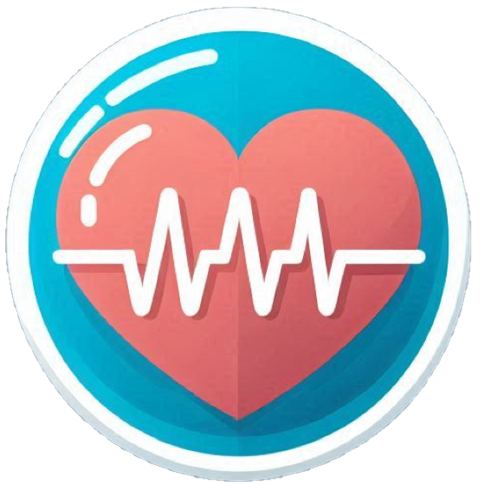

   
   

   
   
   
   

   # Medicloud

   Your go-to solution for health management, updates and guidance.

   ### Video Demo (YouTube)
   

   ## Description
   ***MediCloud*** is a web-based application designed to provide users with a holistic approach to managing their health. The platform offers a range of features including a profile section for personal information, tracking medical history, managing medications, exploring nutritious meals, and staying updated with the latest health news. By integrating various health-related tools into a single platform, MediCloud aims to be a comprehensive solution for users looking to take control of their health and wellness.

   ### Profile:
   It allows users to manage their personal details and view a summary of their health data. It offers a centralized location for all health-related information, making it easier for users to access and update their records. In the Medical History section, users can document conditions, symptoms, and other relevant health information. This feature is particularly useful for tracking changes over time and sharing important information with healthcare providers.

   ### Medications:
   This feature is designed to help users keep track of their medication schedules. Users can add new medications, specifying details such as name, dosage, frequency, and notes. This functionality is essential for those managing multiple medications, ensuring they follow their prescribed regimen accurately.

   ### Meals:
   Here, users can explore a variety of healthy recipes, complete with nutritional information. This feature is powered by the Spoonacular API, providing a rich database of meal options that cater to different dietary preferences. Users can view recipe details and nutritional breakdowns, helping them make informed dietary choices.

   ### Health News:
   In this section aggregates the latest news articles from reputable sources, keeping users informed about new medical research, health trends, and other relevant topics. This feature utilizes the NewsAPI to fetch up-to-date articles, presenting them in a user-friendly format.

   ## Distinctiveness and Complexity
   MediCloud stands out from other health-related applications due to its comprehensive approach. Unlike many apps that focus on a single aspect of health management, MediCloud integrates several critical features. This integration requires careful handling of diverse data types and a seamless user experience across different functionalities. The use of multiple APIs, such as Spoonacular and NewsAPI, adds to the complexity of the project, as it involves fetching and displaying data from external sources in a cohesive manner.

   The application is built using Flask, a lightweight web framework in Python. The frontend employs HTML, CSS (with Bootstrap), and JavaScript, ensuring a responsive and visually appealing design. The backend relies on SQLite for data storage, chosen for its simplicity and ease of setup.

   ## How to Run
   To run MediCloud, follow these steps:

   1. **Set Up Virtual Environment**:
      - Create a virtual environment: `python -m venv venv`
      - Activate the virtual environment:
      - On Windows: `venv\Scripts\activate`
      - On macOS/Linux: `source venv/bin/activate`

   2. **Install Dependencies**:
      - Install the required packages: `pip install -r requirements.txt`

   3. **Run the Application**:
      - Start the application: `python app.py`
      - Access the app locally at `http://127.0.0.1:5000/`

   ## Project Features
   - **Profile Management**: Store and manage personal health information.
   - **Medical History**: Track and review medical conditions and symptoms.
   - **Medications**: Keep track of medications, including dosage and frequency.
   - **Healthy Meals**: Explore recipes with nutritional information.
   - **Health News**: Stay updated with the latest health news articles.

   ## What’s Next?
   Future enhancements for MediCloud may include:
   - Symptom checking and test and medication advice.
   - Personalized meal plans based on user preferences and dietary restrictions.
   - Advanced medication reminders and alerts.
   - Integration of fitness tracking features to provide a more comprehensive health overview.
